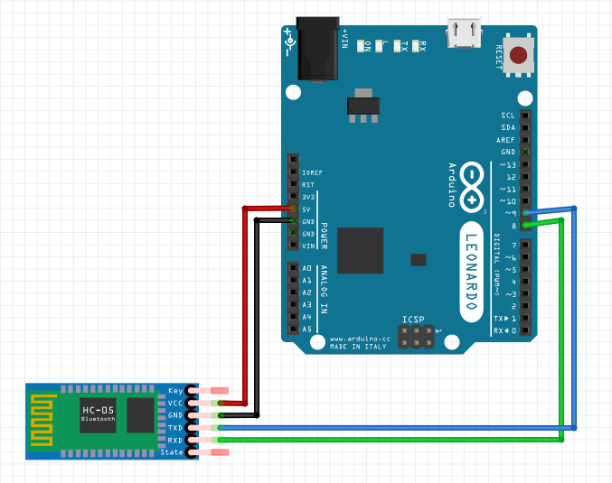

# bluetooth-hid

I wanted to create a USB HID that would send a payload when it receives a wireless message.

The idea is to hide the Arduino Leonardo when the user is not at their computer, then when they return and unlock the computer, to distract them for a couple of seconds so the Leonardo keystrokes can be sent undetected.

Wire the HC-05 bluetooth module to the Arduino Leonardo as follows:

|HC05|Leonardo|
|---|---|
|VCC|5v|
|Gnd|Gnd|
|Tx|Pin 9|
|Rx|Pin 8|

See [senddata.ino](senddata.ino) for the sample sketch. Note: this is only designed for Windows comptuers. It sends a Win+R keystroke, then tells Internet Explorer to open a URL.

Plug the Leonardo in to the computer by USB.

Finally, pair the HC-05 with a bluetooth device, I'm using my android phone. Install an app that can send a single character '1' over bluetooth. I'm using BlueTerm, but there are other options too. In the app connect to the HC-05 device, and type the character 1.

If all went well, you should see the run command open, and the string "iexplore.exe https://www.youtube.com/watch?v=5j-sY41ru4M" be entered.

